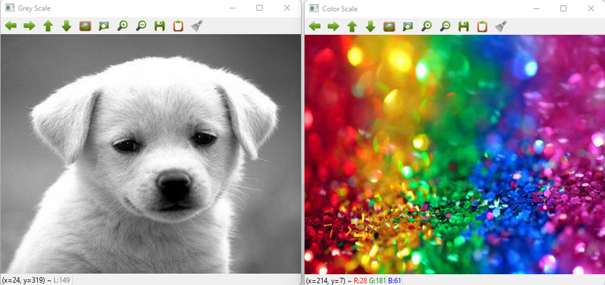

# Histogram and Histogram Equalization of an image
## Aim
To obtain a histogram for finding the frequency of pixels in an Image with pixel values ranging from 0 to 255. Also write the code using OpenCV to perform histogram equalization.

## Software Required:
Anaconda - Python 3.7

## Algorithm:
### Step1:
Import cv2, matplotlib.py libraries and display the saved images using cv2.imshow().

### Step2:
Use cv2.calcHist(images, channels, mask, histSize, ranges[, hist[, accumulate]]) to find the histogram of the image.

### Step3:
Plot the image and its stem plots using the plt.show() and plt.stem() functions.

### Step4:
Equalize the grayscale image using the in-built function cv2.equalizeHist().

### Step5:
Print the original and equalized image using cv2.imshow() and end the program.
## Program:
```python
# Developed By: MIRUDHULA D
# Register Number: 212221230060
import cv2
import matplotlib.pyplot as plt

# Write your code to find the histogram of gray scale image and color image channels.
gray_image = cv2.imread("gray.jpg")
color_image = cv2.imread("color.jpg",-1)
cv2.imshow("Gray Image",gray_image)
cv2.imshow("Colour Image",color_image)
cv2.waitKey(0)
cv2.destroyAllWindows()

# Display the histogram of gray scale image and any one channel histogram from color image
grayscale_image=cv2.imread("1.jpg")
colourscale_image=cv2.imread("2.jpeg")
hist=cv2.calcHist(grayscale_image,[0],None,[256],[0,256])
hist1=cv2.calcHist(colourscale_image,[1],None,[256],[0,256])
plt.figure()
plt.title("Histogram")
plt.xlabel("grayscale")
plt.ylabel("pixel count")
plt.stem(hist)
plt.show()
plt.xlabel("colour scale")
plt.ylabel("pixel count")
plt.stem(hist1)
plt.show()

# Write the code to perform histogram equalization of the image. 
greyscale=cv2.imread("1.jpg",0)
colorscale=cv2.imread("2.jpeg")
g=cv2.resize(greyscale,(500,400))
equ=cv2.equalizeHist(gi)
cv2.imshow("Grey Scale",g)
cv2.imshow("Equalization",equ)
cv2.waitKey(0)
cv2.destroyAllWindows()

```
## Output:
### Input Grayscale Image and Color Image

### Histogram of Grayscale Image and any channel of Color Image


### Histogram Equalization of Grayscale Image


## Result: 
Thus the histogram for finding the frequency of pixels in an image with pixel values ranging from 0 to 255 is obtained. Also,histogram equalization is done for the gray scale image using OpenCV.
